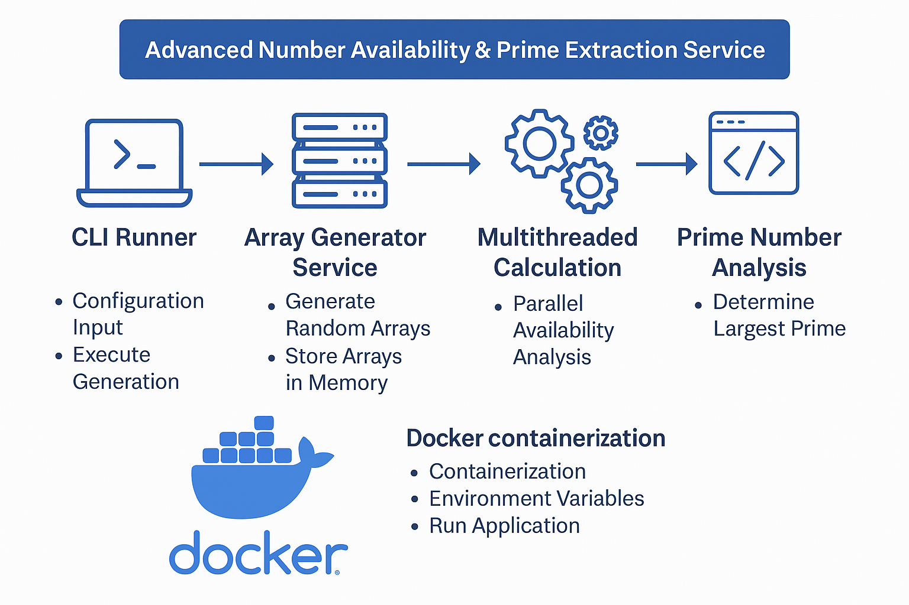
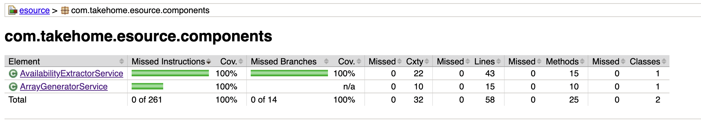

# Advanced Number Availability & Prime Extraction Service

This project implements a backend utility that performs **availability analysis** and **prime extraction** across a configurable number of randomly generated arrays. The service is built using **Java (Spring Boot)**, containerized with **Docker**, and comes with **unit tests** and **Jacoco code coverage**.

## Features

- **Dynamic Array Generation**: Generates a configurable number of random integer arrays.
- **Available Number Extraction**: Identifies numbers missing from any of the arrays.
- **Prime Number Analysis**: Finds the largest prime number from the available numbers.
- **Multithreaded Calculation**: Performs the number extraction in parallel for performance improvement.

## Prerequisites

Ensure that the following tools are installed:

- **Java 11 or 17** (depending on your environment)
- **Gradle**
- **Docker** and **Docker Compose** (for containerization)

## Getting Started

### 1. **Clone the Repository**

```bash
git clone https://github.com/SolusProject/Advanced-Number-Availability.git
```

### 2. **Build the Project**

You can build the project using **Gradle**:

```bash
gradle build
```

This will create the JAR file in the `build/libs/` directory.

### 3. **Running with Docker Compose**

To run the project using **Docker Compose**, follow these steps:

- **Build and start the containers**:

```bash
docker-compose up --build -d
```

This will build the Docker image and start the container in **detached mode**.

- **View logs** of the running container:

```bash
docker-compose logs -f
```

This will show the real-time logs of the container.

### 4. **Access the Application**

Once the container is running, you can access the application at:

```
http://localhost:8080
```

### 5. **Stop the Containers**

To stop and remove the running containers:

```bash
docker-compose down
```

## System Design Diagram

The system design for the **Advanced Number Availability & Prime Extraction Service** is outlined in the diagram below:



## Unit Tests

This project includes unit tests for key functionalities, including:

- **Array Generator**: Ensures the correct generation of random arrays with no duplicates.
- **Availability Service**: Validates the logic for identifying available numbers.
- **Prime-check Utility**: Tests the prime-checking logic for accuracy.

### Running Unit Tests

To run the unit tests:

```bash
gradle test
```

### Jacoco Code Coverage

Jacoco is used to measure code coverage for the project. After running the tests, you can generate a coverage report:

1. Run the tests with coverage:

```bash
gradle test jacocoTestReport
```

2. The coverage report will be generated in:

```
build/reports/jacoco/test/html/index.html
```

Open the **`index.html`** file in your browser to view the detailed coverage report.

### Coverage Screenshot

Here’s a screenshot of the **Jacoco Code Coverage Report**:



## Dockerization

### Dockerfile

The project is containerized with **Docker**. The **Dockerfile** ensures that the application is built and run in a consistent environment. It uses **Amazon Corretto 17** as the Java runtime.

### Docker Compose

The **`docker-compose.yml`** file is configured to:

- Build the image from the **Dockerfile**.
- Expose port `8080` for accessing the Spring Boot application.
- Pass environment variables for configuration (`ARRAY_COUNT`, `ARRAY_SIZE`, etc.).

## Conclusion

This project provides a backend service that performs number availability and prime extraction with configurable arrays. It’s containerized with Docker, and all functionality is covered with unit tests and code coverage metrics using Jacoco.

Let me know if you have any questions or need further information!
